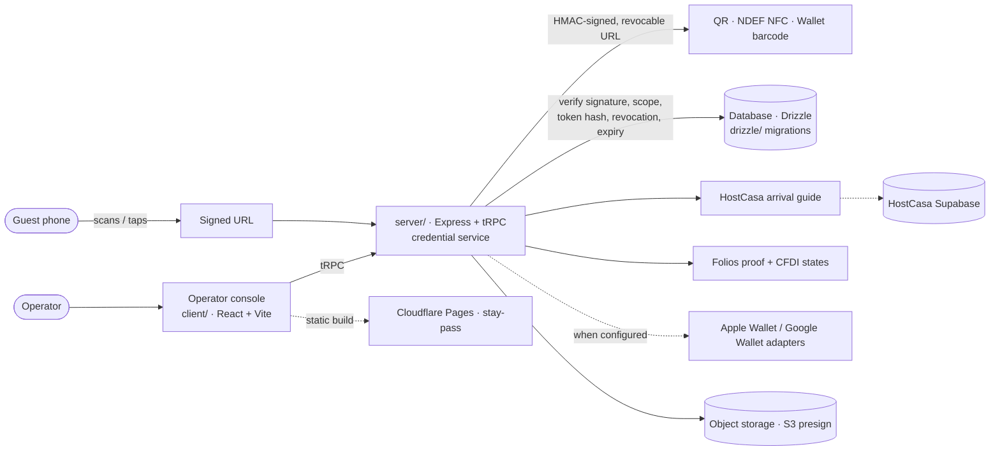

<p align="center">
  
</p>

# Open Stay Pass

[](https://github.com/FriskyDevelopments/open-stay-pass/actions/workflows/ci.yml) [](LICENSE)   

[Brand manual](docs/brand/README.md) · [Claude Design system](docs/brand/claude-design/README.md) · [Community / QR Studio setup](docs/netlify-community-review.md)

> **An English-first, multilingual QR hospitality credential system for small operators.**

[Open the public repository](https://github.com/FriskyDevelopments/open-stay-pass) · [Open the live MVP](https://staypass-pmz7aqns.manus.space) · [Review the English-dub press kit](https://staypass-pmz7aqns.manus.space/press-kit)

Open Stay Pass turns one signed, revocable URL into a useful guest arrival guide, Folios evidence handoff, QR code, NDEF NFC tag, and—when officially configured—Apple Wallet or Google Wallet pass. HostCasa owns guest continuity. Folios owns proof and fiscal handoff. The credential core stays portable.

## Why this exists

Small operators should not need a PMS migration, lock-provider contract, native app, or enterprise rollout to give a guest a reliable arrival experience. The default rail is a mobile-safe signed link. Integrations are progressive upgrades, never first-run requirements.

| Rail | Outcome | Starts with |
|---|---|---|
| **HostCasa** | A calm, bilingual guest arrival guide | QR or signed link |
| **Folios** | A traceable proof and CFDI handoff | The same revocable credential boundary |
| **Open Stay Pass** | Credential lifecycle, QR, NFC, Wallet adapters | Server-side signed token |

## What is real today

- **Signed QR and NDEF URL credentials** with expiry and server-side revocation.
- **Bilingual HostCasa arrival** and **Folios proof handoff** rails.
- **Dynamic CFDI lifecycle**: one link persists while proof, review, issued, cancelled, rejected, or expired state changes.
- **Apple Wallet `.pkpass` issuance** for active issued CFDIs when an official Pass Type ID certificate is configured.
- **Google Wallet adapter contract** that stays hidden until a valid issuer and service-account private key can sign.
- **Smart-lock boundary** that keeps provisioning with HostCasa/a verified provider and never puts door secrets in QR, NFC, Wallet, or browser state.

## Verify a clone

```bash
pnpm install --frozen-lockfile
pnpm validate
```

`pnpm validate` runs the full regression suite, type-check, and production build without committing or copying deployment credentials. The public [live MVP](https://staypass-pmz7aqns.manus.space) exposes the complete QR-first operator flow.

## Community docs and QR Studio

The standalone community surface contains a browser-only QR Studio, the preserved Claude Design system, MIT license, Code of Conduct, and a Netlify attribution link. It encodes public URLs; it does not issue signed credentials or call product APIs.

```bash
pnpm install --frozen-lockfile
pnpm test:community
pnpm check:community
pnpm build:community
python3 -m http.server 4178 --directory dist/oss-review
```

Open `http://localhost:4178`. Build output is isolated in `dist/oss-review`. The intended Netlify review project is `stay-pass-qr-studio`; `staypass.dev` attachment remains a later, separately approved cutover after the OSS plan decision. See [the review-site runbook](docs/netlify-community-review.md).

## Architecture



| Package | What it is |
|---|---|
| `client/`, `server/`, `shared/`, `drizzle/` | The Open Stay Pass web app (React client, Express/tRPC server, shared types, DB migrations) |
| `open-stay-pass/` | `@friskydevelopments/open-stay-pass`, a standalone credential package with a demo server and Docker setup |
| `community/` | Community docs + QR Studio site (`pnpm build:community`) |

## Run the full stack locally

The full application intentionally requires an owner-provisioned local environment because it validates signing, identity, storage, and deployment settings at startup. Configure those values through your own private secret manager or deployment platform—never by committing a `.env` file or embedding values in docs—then run:

```bash
pnpm dev
```

Use the Operator console to create a credential, then scan its QR from a second device or copy the NDEF URL to an NFC tag writer.

The repository includes a locked GitHub Actions validation workflow for pushes and pull requests to `main`. Product and community validation are visible under the repository’s **Actions** tab.

When a public `VITE_GITHUB_REPOSITORY_URL` is configured, successful test and build commands print a non-blocking invitation to star the repository. It never changes exit codes or blocks local development.

### Useful scripts

```bash
pnpm validate          # test + typecheck + build
pnpm test              # Vitest suite
pnpm check             # tsc --noEmit
pnpm db:push           # generate + apply Drizzle migrations
pnpm build:pages       # static frontend build (dist/public)
pnpm deploy:pages      # build + wrangler pages deploy to the stay-pass project
pnpm test:community    # community site tests
```

### Environment variables

Names only, from `.env.example` and the server code. Values are never committed.

- **Core:** `NODE_ENV`, `PORT`, `JWT_SECRET`, `CREDENTIAL_HMAC_SECRET`, `DATABASE_URL`, `CORS_ORIGINS`, `PUBLIC_APP_URL`, `SESSION_MAX_AGE_MS`
- **Identity:** `OAUTH_SERVER_URL`, `OWNER_OPEN_ID`, `VITE_APP_ID`, `VITE_OAUTH_PORTAL_URL`
- **HostCasa / Folios:** `VITE_HOSTCASA_SUPABASE_URL`, `VITE_HOSTCASA_SUPABASE_ANON_KEY`, `FOLIOS_PUBLIC_ORIGIN`, `VITE_OPEN_STAY_API_ORIGIN`
- **Wallet (optional):** `APPLE_PASS_TYPE_ID`, `APPLE_TEAM_ID`, `APPLE_CERTIFICATE_P12_BASE64`, `APPLE_CERTIFICATE_PASSWORD`, `GOOGLE_WALLET_ISSUER_ID`, `GOOGLE_WALLET_SERVICE_ACCOUNT_JSON`, `WALLET_AUTH_TOKEN`, `WALLET_UPDATE_BASE_URL`
- **Storage / concierge:** `BUILT_IN_FORGE_API_URL`, `BUILT_IN_FORGE_API_KEY`, `STORAGE_PUBLIC_PREFIXES`, `CONCIERGE_PROVIDER`, `CONCIERGE_LLM_MODEL`
- **Public links (optional):** `VITE_GITHUB_REPOSITORY_URL`, `VITE_KOFI_URL`, `VITE_WISE_URL`, `VITE_NOWPAYMENTS_URL`

## Security boundary

The QR, NFC tag, and Wallet barcode contain only the same short-lived signed URL. They never contain a lock PIN, BLE key, raw access token, payment data, or permanent authorization. The server re-checks the signature, the expected scope, the stored token hash, the revocation status, and the expiry before resolving a credential.

Read [the smart-lock adapter contract](docs/smart-lock-adapter-contract.md), [Wallet validation status](docs/wallet-demo-validation-status.md), and [Folios Brandbook V2 mapping](docs/folios-brandbook-v2-implementation-map.md) before connecting hardware or publishing a branded fork.

## Open-source contribution

This repository is intentionally built as a reference implementation. Good first contributions include a verified PMS/lock adapter, Spanish/English copy improvement, an accessibility audit, a reproducible Docker installation, or a tested hardware NFC-writing guide. Read [CONTRIBUTING.md](CONTRIBUTING.md) and [SECURITY.md](SECURITY.md) before opening an issue or pull request.

## Optional support

Open Stay Pass offers three optional external community-support paths: **Ko-fi**, **NOWPayments**, and **Wise Business**, using the official project destinations supplied by the maintainer. Deployment configuration may override them through `VITE_KOFI_URL`, `VITE_NOWPAYMENTS_URL`, and `VITE_WISE_URL`, but the destinations are always domain-validated. A GitHub **Star** call-to-action remains hidden until `VITE_GITHUB_REPOSITORY_URL` is a verified `https://github.com/...` repository URL. Support links are not connected to credential, Wallet, NFC, CFDI, or smart-lock authorization.

## License

MIT. See [LICENSE](LICENSE).
